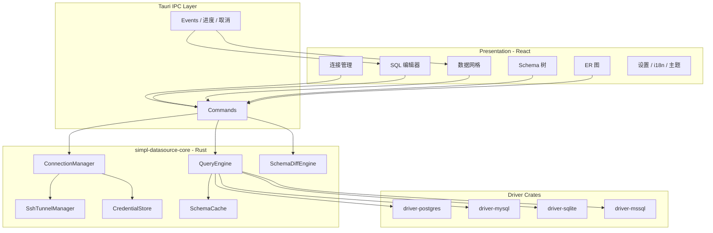
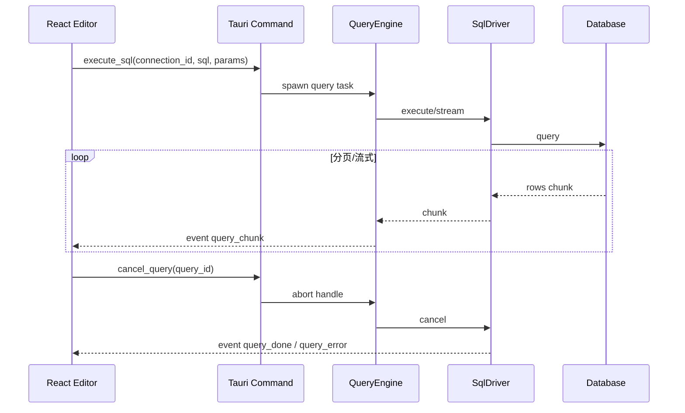
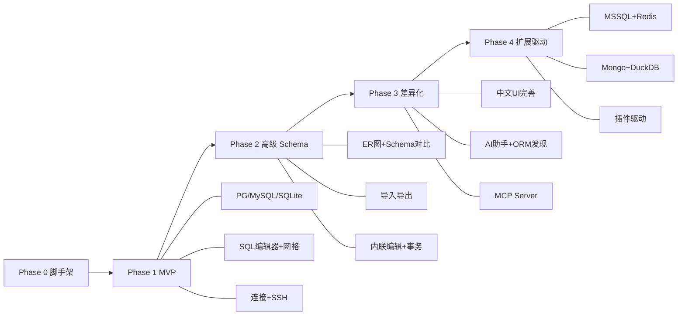

# feat: Rust 数据库 GUI 客户端 (simpl-datasource-client) 全量实现规划

## Summary

在空仓库 `simpl-datasource-client` 中，以 **Tauri 2 + React + Rust 驱动核心** 构建跨平台数据库 GUI 客户端。产品目标是对标并覆盖 DBeaver、Beekeeper Studio、DbGate、TablePlus、HeidiSQL、DataGrip 等同类工具的核心能力，并通过 **中文优先体验、Rust 原生轻量、ORM 连接发现、MCP/AI 集成、Core/GUI 分离** 形成差异化。交付采用分阶段路线图：先落地 PG/MySQL/SQLite 可用 MVP，再补齐 Schema/ER/导入导出/SSH 等高级能力，最后扩展差异化与多数据库支持。

## Problem Frame

当前仓库仅有初始 README 与 LICENSE，无任何实现代码。用户希望从零开始构建一个 **使用 Rust 实现的数据库 GUI 窗体客户端**，功能需达到甚至超越现有开源同类软件，并补齐竞品缺失或薄弱的体验（启动速度、内存占用、中文 UI、开发者工作流集成等）。

竞品格局简要结论：

| 产品 | 优势 | 痛点 |
| --- | --- | --- |
| DBeaver CE | 100+ 数据库、ER 图、Schema 对比、导入导出 | Java 重、UI 复杂、内存高 |
| Beekeeper Studio CE | 现代 UI、易用 | Electron 内存、ER/AI 等多为付费 |
| DbGate CE | ER/Schema 对比、Web 部署、插件 | Electron、部分高级能力付费 |
| TablePlus | 原生极速、UI 精美 | 闭源、免费版 Tab 限制 |
| HeidiSQL | 导入导出强 | Windows 导向、无 ER 图 |
| DataGrip | IDE 级 SQL、AI、重构 | 闭源订阅、重量级 |
| Tabular (Rust/egui) | 纯 Rust 轻量 | SQL 编辑器/网格生态弱 |
| dbfordevs (Tauri) | 开发者向、Schema diff | 数据库覆盖与生态仍在早期 |

Rust 生态已有 Tabular、dbfordevs、DataZen、QueryArk 等参考实现，证明 **Tauri + sqlx** 或 **egui + tokio** 路径可行；本项目选择 Tauri 路径以更快达到「专业 SQL 编辑器 + 虚拟化数据网格」的产品标准。

---

## Requirements

### 核心体验

- R1. 应用可在 Windows、macOS、Linux 上以原生桌面窗体运行，冷启动时间 ≤ 3 秒（MVP 阶段在开发机构建上可测）。
- R2. 空闲内存占用目标 ≤ 150 MB（不含单次大结果集缓存），显著低于 Electron 全功能客户端与 Java 客户端。
- R3. 界面支持亮色/暗色主题，并 **默认提供完整简体中文 UI**（菜单、向导、错误提示、空状态文案）。
- R4. 所有数据库 I/O 在 Tokio 异步线程执行，UI 线程永不阻塞；长查询可取消。

### 连接与安全

- R5. 支持创建、编辑、删除、分组（文件夹/标签）数据库连接配置；支持 Dev/Staging/Prod 等环境标签。
- R6. 连接密码与敏感字段通过 OS Keychain（`keyring`）或 AES-GCM 本地加密存储，禁止明文落盘。
- R7. 支持 SSL/TLS 连接配置（CA 文件、verify 模式）。
- R8. 支持 SSH 隧道连接（纯 Rust `russh` 为主，可选 fallback 到系统 `ssh` 以复用 `~/.ssh/config`）。
- R9. 支持连接测试、只读连接模式、生产环境连接二次确认（可配置）。

### SQL 工作台

- R10. 提供多 Tab SQL 编辑器：语法高亮、自动补全（schema-aware：库/表/列/关键字）、格式化、多语句执行、参数化查询占位符。
- R11. 查询结果以表格展示，支持服务端分页与前端虚拟滚动，单页默认 200 行，可流畅浏览 10 万行级结果（分页加载）。
- R12. 显示执行耗时、影响行数、错误定位（行/列）；支持 EXPLAIN 结果可视化（表格 + 简易计划树，MVP 先表格）。
- R13. 查询历史可按连接/时间/关键字检索；支持收藏 SQL 与文件夹分类。
- R14. Tab 会话持久化：重启后恢复未关闭的查询 Tab 与草稿内容。

### Schema 与数据

- R15. 左侧 Schema 树：库 → 表/视图/函数/过程 → 列/索引/约束；支持模糊搜索与类型过滤。
- R16. 表数据浏览：排序、列过滤、Excel 式多条件过滤、FK 跳转、主从（master/detail）关联浏览。
- R17. 内联单元格编辑：基于主键生成 UPDATE/DELETE/INSERT，变更前预览 SQL，支持事务 Commit/Rollback（类似 TablePlus Safe Mode）。
- R18. DDL 查看；表结构可视化编辑（列类型、默认值、PK/FK、索引）；保存前 SQL 预览。
- R19. 自动生成 ER 图（基于外键关系），支持拖拽布局、缩放、导出 PNG/SVG。
- R20. Schema 对比：两连接或连接 vs 本地 YAML 模型 diff，生成可审阅的同步脚本（不自动执行）。

### 导入导出与工具

- R21. 表/结果集导出：CSV、JSON、JSONL、SQL INSERT、XLSX。
- R22. 表/文件导入：CSV、JSON，带列映射预览与批量导入进度。
- R23. 跨库数据传输向导（同源类型优先，如 PG → PG），MVP 后可扩展。
- R24. 会话管理：查看活动连接、运行中查询、锁等待（按数据库能力降级展示）。

### 差异化能力

- R25. **ORM/配置文件连接发现**：扫描工作区 `.env`、`database.yml`、`prisma/schema.prisma`、`drizzle.config.*` 等，一键导入连接（可选功能，可关闭）。
- R26. **AI SQL 助手（BYOK）**：用户自带 OpenAI/Anthropic/Ollama 等 API Key；基于当前 schema 上下文生成/解释/修复 SQL；本地 Key 加密存储。
- R27. **MCP Server 模式（可选启动）**：对外暴露只读 schema 查询与受控 SQL 执行，供 Cursor/Claude 等 Agent 调用。
- R28. **Core 库独立**：`simpl-datasource-core` 可被 CLI/TUI 复用，GUI 仅作 IPC 壳层。

### 数据库支持（分阶段）

- R29. MVP：PostgreSQL、MySQL/MariaDB、SQLite。
- R30. Phase 2：Microsoft SQL Server（`tiberius`）、Redis（只读/命令面板）。
- R31. Phase 3：MongoDB（文档浏览 + JSON 视图）、DuckDB（嵌入式/分析）。
- R32. 插件式驱动扩展接口：第三方可通过 JSON-RPC 或 Rust dynamic loader 注册新驱动（Phase 3+）。

### 工程质量

- R33. 单元测试覆盖驱动层、连接加密、SQL 解析辅助逻辑；集成测试使用 Docker Compose 启动 PG/MySQL/SQLite。
- R34. CI：fmt、clippy、前端 lint、核心 crate 测试；Tauri 构建仅在 tag/release 触发。
- R35. 用户可配置数据目录（连接、历史、设置），支持便携模式（单目录携带全部配置）。

---

## Key Technical Decisions

| ID | 决策 | 理由 |
| --- | --- | --- |
| KTD-1 | **Tauri 2 + React 18 + TypeScript + Vite** 作为 GUI 壳 | SQL 编辑器（CodeMirror 6）、虚拟化表格（TanStack Table + Virtual）、i18n 生态成熟；dbfordevs/DataZen/QueryDeck 已验证；纯 egui 实现同等 UI 成本高 3–5 倍 |
| KTD-2 | **Cargo workspace 多 crate 架构**，GUI 与驱动解耦 | 满足 R28；驱动可独立测试；未来 CLI 复用；参考 QueryArk `DbDriver` trait |
| KTD-3 | **MVP 驱动：sqlx**（PG/MySQL/SQLite），**MSSQL：tiberius + bb8** | sqlx 统一异步 API；tiberius 为 Rust 社区 MSSQL 事实标准 |
| KTD-4 | **Driver Trait 抽象** | `connect / disconnect / execute / fetch_page / introspect / explain / dialect` 统一接口；新数据库仅实现 trait + 注册 |
| KTD-5 | **IPC：Tauri command + event** | 大数据集分块传输；进度/取消通过 event 推送；避免单次 IPC 超大 payload |
| KTD-6 | **SSH：russh 默认 + 系统 ssh 可选** | 纯 Rust 易打包；系统 ssh 兼容 JumpHost/ProxyCommand（DataZen/Tabularis 模式） |
| KTD-7 | **凭证：keyring + AES-GCM 本地备份** | 跨平台 Keychain 一致；无 Keychain 环境降级加密文件 |
| KTD-8 | **SQL 解析：sqlparser-rs** | 多语句拆分、格式化、方言识别辅助；不替代数据库执行 |
| KTD-9 | **Schema 模型内存缓存 + 增量刷新** | 自动补全/ER 图/对比依赖；连接级 TTL 缓存，DDL 变更后手动刷新 |
| KTD-10 | **许可：MIT** | 与 README 方向一致，利于社区与商业友好；避免 GPL/AGPL 传染 |
| KTD-11 | **中文 i18n 为首发语言**，英文为第二语言 | 差异化；使用 `i18next` + `react-i18next` |
| KTD-12 | **不做 JDBC/ODBC 万能桥作为 MVP** | 100+ 数据库是 18+ 月工程；插件化后再考虑 `odbc-api` |

---

## High-Level Technical Design

### 系统分层



### 查询执行与取消流程



### 驱动 Trait（方向性设计，非最终实现）

```text
trait SqlDriver: Send + Sync {
  fn dialect(&self) -> Dialect;
  async fn test_connection(&self) -> Result<()>;
  async fn introspect(&self) -> Result<SchemaMeta>;
  async fn execute(&self, sql: &str, params: &[Value]) -> Result<ExecuteResult>;
  async fn fetch_page(&self, req: TablePageRequest) -> Result<RowPage>;
  async fn explain(&self, sql: &str) -> Result<ExplainPlan>;
  async fn begin_transaction(&self) -> Result<TransactionHandle>;
}
```

### 分阶段交付路线图



---

## Scope Boundaries

### 本规划范围内

- 桌面 GUI 客户端（Tauri）及 Rust core 库
- MVP 三库 + Phase 2–4 路线图中的功能模块
- 中文/英文 i18n
- 本地优先：数据与凭证不上云（AI BYOK 除外，用户自选）

### Deferred for later

- Cloud/Web 版自托管（DbGate 模式）——架构预留 HTTP adapter，不纳入 Phase 1–3
- 100+ 数据库 JDBC 桥
- 可视化 Query Builder（无 SQL 拖拽构建器）——Phase 4+ 评估
- 团队协作：连接共享、审计日志、多设备同步
- 移动端/iPad 客户端
- 内置数据图表/GEO 地图（DbGate 特色）——低优先级

### Outside this product's identity

- 数据库服务器本身（非 Server 产品）
- ETL/调度平台（仅提供单次导入导出与脚本任务，不做 Cron 调度中心）
- 替代 ORM/迁移框架（可读取配置，不取代 Prisma/Diesel 等）

### Deferred to Follow-Up Work

- 商业授权/Pro 版功能分层（规划阶段全部按开源能力设计）
- Windows 安装包代码签名与 macOS Notarization 自动化
- 官网与文档站点（用户未要求 MD 文档站点，仅 README + 内嵌帮助）

---

## Alternative Approaches Considered

| 方案 | 优点 | 缺点 | 结论 |
| --- | --- | --- | --- |
| **A. 纯 Rust egui/eframe** | 单二进制、最低内存、Tabular 已验证 | CodeMirror 级编辑器需自建；大数据网格成本高 | 不作为主产品；可作为远期 `simpl-datasource-lite` 实验分支 |
| **B. Tauri + React（选用）** | UI 效率最高、生态成熟 | 依赖 WebView，非 100% 原生控件 | **主线路** |
| **C. Iced 纯 Rust** | 原生感、Elm 架构清晰 | DB GUI 先例少、表格/编辑器组件缺 | 不选用 |
| **D. Electron + Rust native addon** | 与 Beekeeper 同构，前端人才多 | 内存与体积劣势，与「Rust 轻量」目标冲突 | 不选用 |
| **E. 先 CLI 后 GUI** | Core 验证充分 | 用户明确要求 GUI 窗体 | Core 与 GUI 并行，但 GUI 为交付主界面 |

---

## Output Structure

```text
simpl-datasource-client/
├── Cargo.toml                      # workspace root
├── crates/
│   ├── core/                       # 连接管理、查询引擎、Schema 缓存、Diff
│   ├── driver-trait/               # SqlDriver trait 与共享类型
│   ├── driver-postgres/
│   ├── driver-mysql/
│   ├── driver-sqlite/
│   ├── driver-mssql/               # Phase 2
│   ├── ssh/                        # russh 隧道
│   ├── credential/                 # keyring + 加密
│   ├── sql-utils/                  # sqlparser 封装、格式化
│   ├── schema-diff/                # 对比引擎
│   ├── orm-discovery/              # .env / Prisma / Drizzle 扫描
│   ├── ai-assistant/               # BYOK LLM 调用
│   └── mcp-server/                 # MCP 协议服务
├── src-tauri/
│   ├── src/
│   │   ├── lib.rs
│   │   ├── commands/               # IPC command 模块
│   │   └── state.rs                # AppState
│   ├── tauri.conf.json
│   └── capabilities/
├── src/                            # React 前端
│   ├── app/
│   ├── features/
│   │   ├── connections/
│   │   ├── editor/
│   │   ├── grid/
│   │   ├── schema/
│   │   ├── er-diagram/
│   │   ├── import-export/
│   │   └── settings/
│   ├── components/
│   ├── i18n/
│   │   ├── zh-CN/
│   │   └── en/
│   └── lib/
├── tests/
│   └── integration/                # docker-compose 集成测试
├── docker-compose.test.yml
├── package.json
└── README.md
```

---

## Implementation Units

> 按依赖顺序排列。U-ID 稳定，不随阶段调整而重编号。

### Phase 0 — 工程脚手架

### U1. Cargo Workspace 与 Tauri 2 项目初始化

- **Goal:** 建立可 `tauri dev` 运行的最小跨平台壳，前后端通信打通。
- **Requirements:** R1, R33, R34
- **Dependencies:** 无
- **Files:**
  - `Cargo.toml`
  - `crates/driver-trait/Cargo.toml`
  - `crates/driver-trait/src/lib.rs`
  - `src-tauri/Cargo.toml`
  - `src-tauri/src/lib.rs`
  - `src-tauri/src/commands/mod.rs`
  - `src-tauri/tauri.conf.json`
  - `package.json`
  - `vite.config.ts`
  - `src/main.tsx`
  - `src/App.tsx`
  - `.github/workflows/ci.yml`
- **Approach:** Tauri 2 官方模板精简；workspace 仅含 `driver-trait` 与 `src-tauri`；前端 React + TS + Vite；CI 跑 `cargo fmt/clippy/test` 与 `npm run lint`。
- **Test scenarios:**
  - Happy path: `ping` command 返回 pong，前端展示连接状态。
  - Edge case: 无数据库时应用正常启动并显示空状态页。
- **Verification:** 三平台至少 Linux CI 构建通过；本地 `tauri dev` 可启动窗体。

### U2. 共享类型与 Driver Trait 定义

- **Goal:** 定义跨 IPC 的 serde 类型与 `SqlDriver` trait 契约。
- **Requirements:** R28, R29
- **Dependencies:** U1
- **Files:**
  - `crates/driver-trait/src/lib.rs`
  - `crates/driver-trait/src/types.rs`
  - `crates/driver-trait/src/error.rs`
  - `crates/core/Cargo.toml`
  - `crates/core/src/lib.rs`
- **Approach:** 定义 `ConnectionConfig`、`SchemaMeta`、`ColumnMeta`、`RowPage`、`ExecuteResult`、`Dialect`；trait 方法 async，错误统一 `DriverError`。
- **Test scenarios:**
  - Happy path: 类型 serde 往返 JSON 无丢失。
  - Error path: `DriverError` 含 user_message 供 i18n 映射。
- **Verification:** trait 文档注释完整；core crate 单元测试通过。

---

### Phase 1 — MVP 核心闭环

### U3. 凭证存储与连接管理 Core

- **Goal:** 实现连接 CRUD、加密持久化、连接测试。
- **Requirements:** R5, R6, R7, R9, R35
- **Dependencies:** U2
- **Files:**
  - `crates/credential/Cargo.toml`
  - `crates/credential/src/lib.rs`
  - `crates/core/src/connection_manager.rs`
  - `crates/core/src/persistence.rs`
  - `src-tauri/src/commands/connection.rs`
  - `src/features/connections/ConnectionList.tsx`
  - `src/features/connections/ConnectionForm.tsx`
  - `src/i18n/zh-CN/connections.json`
- **Approach:** 连接 JSON 存于可配置 data dir；密码字段 keyring 存引用；ConnectionManager 维护活跃连接池 HashMap。
- **Test scenarios:**
  - Happy path: 创建连接 → 重启 → 列表仍在，密码可解密。
  - Error path: keyring 不可用 → 降级 AES 文件加密并提示。
  - Edge case: 只读模式标志写入连接元数据。
- **Verification:** 集成测试 mock driver 连接测试成功/失败路径。

### U4. PostgreSQL / MySQL / SQLite 驱动实现

- **Goal:** 三库 sqlx 驱动实现 `SqlDriver` 全部 MVP 方法。
- **Requirements:** R29
- **Dependencies:** U2, U3
- **Files:**
  - `crates/driver-postgres/`
  - `crates/driver-mysql/`
  - `crates/driver-sqlite/`
  - `crates/core/src/driver_registry.rs`
  - `docker-compose.test.yml`
  - `tests/integration/drivers_test.rs`
- **Approach:** 每库独立 crate；sqlx 连接池；`introspect` 查 information_schema；`fetch_page` 参数化 LIMIT/OFFSET。
- **Execution note:** 集成测试依赖 Docker Compose，先写 PG 用例再扩展。
- **Test scenarios:**
  - Happy path: PG/MySQL/SQLite 各执行 SELECT、INSERT、事务回滚。
  - Edge case: SQLite 文件路径连接；MySQL charset 配置。
  - Error path: 错误密码 → 明确错误码与消息。
- **Verification:** CI 中 docker-compose 三库测试绿。

### U5. Schema 树与元数据缓存

- **Goal:** 左侧导航树展示 Schema 对象，支持搜索与刷新。
- **Requirements:** R15
- **Dependencies:** U4
- **Files:**
  - `crates/core/src/schema_cache.rs`
  - `src-tauri/src/commands/schema.rs`
  - `src/features/schema/SchemaTree.tsx`
  - `src/features/schema/SchemaSearch.tsx`
- **Approach:** 连接后异步 introspect 填充缓存；树节点懒加载；DDL 双击打开新 Tab。
- **Test scenarios:**
  - Happy path: 展开 database → tables → columns 与真实库一致。
  - Edge case: 空库仅显示 database 节点。
  - Integration: introspect 后缓存命中，二次打开无重复全量查询（可配置强制刷新）。
- **Verification:** 手动 + 集成测试 introspect 结构快照对比。

### U6. SQL 编辑器与查询执行

- **Goal:** 多 Tab CodeMirror 6 编辑器，执行 SQL 并流式返回结果。
- **Requirements:** R10, R12, R14, R4
- **Dependencies:** U4, U5
- **Files:**
  - `crates/core/src/query_engine.rs`
  - `crates/sql-utils/`
  - `src-tauri/src/commands/query.rs`
  - `src/features/editor/SqlEditor.tsx`
  - `src/features/editor/EditorTabs.tsx`
  - `src/features/editor/CompletionProvider.ts`
  - `src/features/editor/sessionPersistence.ts`
- **Approach:** sqlparser 拆分多语句；QueryEngine 每查询一个 cancel token；结果分 chunk event 推送；schema 补全走 SchemaCache。
- **Test scenarios:**
  - Happy path: 多语句脚本顺序执行，结果 Tab 分离。
  - Happy path: 重启恢复 Tab 草稿。
  - Error path: 语法错误显示数据库返回信息。
  - Edge case: 取消长查询后连接仍可用。
- **Verification:** 10 万行 PG 查询分页加载 UI 不冻结（人工/Playwright 可选）。

### U7. 数据网格（分页 + 虚拟滚动）

- **Goal:** 表数据浏览与查询结果共用网格组件。
- **Requirements:** R11, R16
- **Dependencies:** U6
- **Files:**
  - `src/features/grid/DataGrid.tsx`
  - `src/features/grid/ColumnFilter.tsx`
  - `src/features/grid/types.ts`
  - `src-tauri/src/commands/table_data.rs`
  - `crates/core/src/query_engine.rs`（扩展 fetch_page）
- **Approach:** TanStack Table + Virtual；服务端排序/filter 参数化；JSON/二进制列专用渲染器。
- **Test scenarios:**
  - Happy path: 翻页、排序、列宽调整状态保持。
  - Edge case: 0 行结果展示空状态。
  - Edge case: NULL 与特殊类型显示正确。
- **Verification:** 1 万行本地 SQLite 表滚动帧率可接受。

### U8. SSH 隧道集成

- **Goal:** 连接配置支持 SSH，数据库流量经隧道转发。
- **Requirements:** R8
- **Dependencies:** U3, U4
- **Files:**
  - `crates/ssh/Cargo.toml`
  - `crates/ssh/src/lib.rs`
  - `crates/core/src/connection_manager.rs`
  - `src/features/connections/SshConfigSection.tsx`
- **Approach:** russh 建立本地端口转发；ConnectionManager 在 connect 时先起隧道；disconnect 关闭隧道。
- **Test scenarios:**
  - Happy path: docker-compose 内 SSH bastion + PG 连接成功。
  - Error path: SSH 密钥错误 → 用户可读错误。
  - Edge case: 同一 SSH 配置复用到多个 DB 连接。
- **Verification:** 集成测试覆盖 SSH jump 场景（可用 testcontainers）。

### U9. 查询历史与 SQL 收藏

- **Goal:** 自动记录执行历史，支持收藏与搜索。
- **Requirements:** R13
- **Dependencies:** U6
- **Files:**
  - `crates/core/src/query_history.rs`
  - `src-tauri/src/commands/history.rs`
  - `src/features/editor/HistoryPanel.tsx`
  - `src/features/editor/SavedQueries.tsx`
- **Approach:** SQLite 本地索引库（应用元数据，非用户业务库）存储历史；按 connection_id + timestamp 索引。
- **Test scenarios:**
  - Happy path: 执行后历史可见；收藏后出现在 Saved 列表。
  - Edge case: 历史条目上限可配置淘汰。
- **Verification:** 单元测试写入/检索/分页。

### U10. 主题、布局与中文 i18n 基线

- **Goal:** 暗色/亮色主题，完整中文 UI 覆盖 MVP 模块。
- **Requirements:** R3, R11
- **Dependencies:** U3, U6, U7
- **Files:**
  - `src/i18n/index.ts`
  - `src/i18n/zh-CN/*.json`
  - `src/i18n/en/*.json`
  - `src/app/ThemeProvider.tsx`
  - `src/app/MainLayout.tsx`
- **Approach:** i18next；CSS 变量主题；布局：左侧 Schema + 中央 Editor/Grid + 底部可折叠面板。
- **Test scenarios:**
  - Happy path: 切换语言后连接表单/错误提示为中文。
  - Happy path: 主题切换持久化。
- **Verification:** 无硬编码英文用户可见字符串（CI grep 检查可选）。

---

### Phase 2 — 高级 Schema 与数据工具

### U11. 内联编辑与事务 Safe Mode

- **Goal:** 网格内编辑单元格，生成 DML 预览，事务提交/回滚。
- **Requirements:** R17, R4
- **Dependencies:** U7
- **Files:**
  - `crates/core/src/dml_generator.rs`
  - `src/features/grid/InlineEdit.tsx`
  - `src/features/grid/ChangePreviewDialog.tsx`
  - `src/features/grid/TransactionBar.tsx`
- **Approach:** 基于 PK 检测生成 UPDATE；无 PK 表禁止 inline edit 并提示；变更批量累积到未提交事务。
- **Test scenarios:**
  - Happy path: 修改单元格 → 预览 SQL → Commit 生效。
  - Error path: Rollback 后数据恢复。
  - Edge case: 无 PK 表显示只读徽章。
- **Verification:** 集成测试 UPDATE 后 SELECT 验证。

### U12. 表结构编辑器与 DDL 预览

- **Goal:** 可视化编辑列/索引/约束，保存前展示 DDL。
- **Requirements:** R18
- **Dependencies:** U5
- **Files:**
  - `src/features/schema/TableDesigner.tsx`
  - `src-tauri/src/commands/ddl.rs`
  - `crates/core/src/ddl_generator.rs`
- **Approach:** 方言特定 DDL 生成；ALTER 不可行时提示表重建风险（参考 DbGate）。
- **Test scenarios:**
  - Happy path: 新增列 → 预览 ALTER → 执行后 Schema 树更新。
  - Error path: SQLite 受限 ALTER 提示重建。
- **Verification:** PG/SQLite 各一例集成测试。

### U13. ER 图生成与导出

- **Goal:** 从 Schema 自动生成 ER 图，可交互布局并导出。
- **Requirements:** R19
- **Dependencies:** U5
- **Files:**
  - `src/features/er-diagram/ErDiagram.tsx`
  - `src/features/er-diagram/layout.ts`
  - `src-tauri/src/commands/er.rs`
  - `crates/core/src/er_builder.rs`
- **Approach:** 前端 React Flow 或 ELK 布局；边来自 FK；导出 SVG/PNG 用 canvas/html-to-image。
- **Test scenarios:**
  - Happy path: 含 FK 的库生成正确边。
  - Edge case: 无 FK 库仅展示孤立表节点。
- **Verification:** 快照测试 ER 节点/边数量。

### U14. Schema 对比与同步脚本生成

- **Goal:** 两源 diff，分类展示 equal/changed/added/removed，生成 deploy 脚本。
- **Requirements:** R20
- **Dependencies:** U5, U12
- **Files:**
  - `crates/schema-diff/`
  - `src/features/schema/SchemaCompare.tsx`
  - `src-tauri/src/commands/schema_diff.rs`
- **Approach:** 内存 SchemaMeta 对比；输出 SQL 脚本不自动执行；支持导出 YAML 模型（单表一文件）。
- **Test scenarios:**
  - Happy path: 两 PG 库 diff 检出新增列。
  - Edge case: 忽略 FK 选项生效。
- **Verification:** 单元测试 diff 分类正确性。

### U15. 导入导出向导

- **Goal:** CSV/JSON/SQL/XLSX 导入导出，带列映射。
- **Requirements:** R21, R22
- **Dependencies:** U7
- **Files:**
  - `crates/core/src/export/mod.rs`
  - `crates/core/src/import/mod.rs`
  - `src/features/import-export/ExportDialog.tsx`
  - `src/features/import-export/ImportWizard.tsx`
- **Approach:** 流式读写大文件；导入批量 INSERT；进度 event 推送。
- **Test scenarios:**
  - Happy path: 表导出 CSV 再导入新表数据一致。
  - Edge case: 导入列映射不匹配时阻断并提示。
- **Verification:** 10 万行 CSV 导出内存峰值可控。

### U16. EXPLAIN 可视化增强

- **Goal:** 执行计划表格 + 简易树形视图。
- **Requirements:** R12
- **Dependencies:** U6
- **Files:**
  - `src/features/editor/ExplainPanel.tsx`
  - `crates/core/src/explain.rs`
- **Approach:** PG `EXPLAIN FORMAT JSON`、MySQL `EXPLAIN`、SQLite `EXPLAIN QUERY PLAN` 分方言解析。
- **Test scenarios:**
  - Happy path: PG JSON plan 渲染为树。
  - Edge case: 不支持 EXPLAIN 的语句显示降级提示。
- **Verification:** 各库一例集成测试。

---

### Phase 3 — 差异化能力

### U17. ORM / 配置文件连接发现

- **Goal:** 扫描工作区配置文件，一键导入连接。
- **Requirements:** R25
- **Dependencies:** U3
- **Files:**
  - `crates/orm-discovery/`
  - `src/features/connections/DiscoveryWizard.tsx`
  - `src-tauri/src/commands/discovery.rs`
- **Approach:** 递归扫描用户选定目录；解析 `.env`、`DATABASE_URL`、Prisma datasource；冲突时让用户选择覆盖/跳过。
- **Test scenarios:**
  - Happy path: `.env` 含 `DATABASE_URL` 解析为 PG 连接。
  - Happy path: `prisma/schema.prisma` 解析多 datasource。
  - Edge case: 无权限目录跳过并汇总报告。
- **Verification:** fixture 目录单元测试。

### U18. AI SQL 助手（BYOK）

- **Goal:** 基于 schema 上下文生成/解释/修复 SQL。
- **Requirements:** R26
- **Dependencies:** U5, U6
- **Files:**
  - `crates/ai-assistant/`
  - `src/features/editor/AiAssistantPanel.tsx`
  - `src/features/settings/AiSettings.tsx`
- **Approach:** 用户配置 provider/base_url/api_key；prompt 注入当前库 schema 摘要；流式响应；Key 走 credential crate。
- **Test scenarios:**
  - Happy path: mock LLM 返回 SQL 插入编辑器。
  - Error path: 无 API Key 时功能入口禁用并说明。
- **Verification:** 单元测试 prompt 构建不含完整数据行（仅 schema）。

### U19. MCP Server 模式

- **Goal:** 可选启动 MCP 服务，暴露 schema 与只读查询工具。
- **Requirements:** R27
- **Dependencies:** U4, U5
- **Files:**
  - `crates/mcp-server/`
  - `src-tauri/src/commands/mcp.rs`
  - `src/features/settings/McpSettings.tsx`
- **Approach:** stdio MCP；tools: `list_tables`, `describe_table`, `execute_readonly_sql`（需用户预授权连接）；SQL 仅允许 SELECT/EXPLAIN 白名单。
- **Test scenarios:**
  - Happy path: MCP client 调用 list_tables 返回表名。
  - Error path: INSERT 语句被拒绝。
- **Verification:** MCP 协议集成测试。

### U20. 会话管理与只读保护

- **Goal:** 活动会话列表、运行查询展示；生产连接保护。
- **Requirements:** R9, R24
- **Dependencies:** U3, U6
- **Files:**
  - `crates/core/src/session_monitor.rs`
  - `src/features/schema/SessionPanel.tsx`
  - `src/features/connections/ProductionGuard.tsx`
- **Approach:** 按驱动能力查询 pg_stat_activity 等；生产标签连接执行 DML 前 Modal 确认。
- **Test scenarios:**
  - Happy path: PG 显示当前连接 PID。
  - Edge case: SQLite 会话面板显示「不支持」降级。
- **Verification:** PG 集成测试。

---

### Phase 4 — 扩展数据库与插件

### U21. Microsoft SQL Server 驱动

- **Goal:** tiberius 实现 SqlDriver。
- **Requirements:** R30
- **Dependencies:** U2, U3
- **Files:** `crates/driver-mssql/`
- **Approach:** 与 sqlx 驱动并列注册；T-SQL 补全方言差异。
- **Test scenarios:** docker MSSQL 连接、SELECT、分页。
- **Verification:** CI docker 测试。

### U22. Redis 与 MongoDB 基础浏览

- **Goal:** Redis key 浏览/命令执行；MongoDB collection JSON 视图。
- **Requirements:** R31
- **Dependencies:** U2
- **Files:** `crates/driver-redis/`, `crates/driver-mongodb/`, 对应 UI feature 模块
- **Approach:** 非关系型驱动实现精简 trait（无 SQL）；UI 复用 JSON 查看器。
- **Test scenarios:** Redis SET/GET；Mongo find 分页。
- **Verification:** testcontainers 集成测试。

### U23. 插件驱动接口

- **Goal:** 第三方驱动注册协议与示例插件。
- **Requirements:** R32
- **Dependencies:** U2
- **Files:**
  - `crates/driver-trait/src/plugin.rs`
  - `plugins/example-jsonrpc-driver/`
  - `docs/plugins/README.md`（插件开发说明，随插件系统一并交付）
- **Approach:** JSON-RPC over stdio 子进程；core 启动 plugin 并代理 trait 调用。
- **Test scenarios:** example plugin 注册虚拟驱动并响应 ping。
- **Verification:** 插件 e2e 测试。

---

## Risks & Dependencies

| 风险 | 影响 | 缓解 |
| --- | --- | --- |
| Tauri 2/WebView 平台差异 | 某 OS 上渲染或 IPC 行为不一致 | 三平台 CI；早期在 Linux/Windows/macOS 各测一轮 |
| sqlx 版本与数据库方言差异 | DDL/DML 生成错误 | 方言分模块；集成测试覆盖三库；Danger DDL 预览 |
| 大数据结果集 OOM | 内存暴涨 | 强制分页/流式；单次结果行数上限可配置 |
| SSH 场景复杂（JumpHost/Kerberos） | 部分用户无法连接 | russh + 系统 ssh 双路径；文档说明支持矩阵 |
| AI 功能合规与 Key 泄露 | 安全风险 | BYOK 本地加密；默认关闭；日志脱敏 |
| MCP 误用导致数据泄露 | 生产数据暴露 | 只读白名单；显式启用；连接级授权 |
| 范围膨胀（对标 DBeaver 全量） | 无法交付 | 严格分 Phase；MVP 仅三库 |
| 纯 Rust MSSQL/Oracle 驱动成熟度 | 功能缺口 | Phase 2 起逐步引入；不承诺 Oracle MVP |

**外部依赖：** Rust 1.77+、Node 20+、Tauri 2 CLI、Docker（集成测试）、各数据库官方/社区 crate 维护状态。

---

## System-Wide Impact

- **安全边界：** 所有 SQL 执行必须经 QueryEngine，MCP/AI 不可绕过只读策略。
- **数据生命周期：** 连接配置与历史存本地；卸载时可选手动清除 data dir。
- **性能 posture：** UI 默认虚拟滚动；Schema 全量 introspect 可后台增量。
- **可访问性：** 快捷键体系对标 TablePlus/DataGrip（执行、格式化、新建 Tab、聚焦编辑器）。
- **Agent parity：** MCP tools 与 GUI 操作共享 core 层，避免双轨逻辑。

---

## Acceptance Examples

- **AE1. 首次连接 PostgreSQL**
  - **Given:** 用户安装应用，本地 Docker PG 运行
  - **When:** 新建连接 → 测试 → 保存 → 双击表
  - **Then:** Schema 树展示表；数据网格分页显示行；SQL 编辑器可查询

- **AE2. SSH 隧道连接**
  - **Given:** 数据库仅 SSH 后端可达
  - **When:** 配置 SSH + DB 连接并连接
  - **Then:** 连接成功，行为与直连一致

- **AE3. 内联编辑 Safe Mode**
  - **Given:** 表含主键，连接非只读
  - **When:** 编辑单元格 → 预览 → Commit
  - **Then:** 数据库值更新；Rollback 可撤销未提交变更

- **AE4. Schema 对比**
  - **Given:** 两库结构差一列
  - **When:** 选择两连接执行 Compare
  - **Then:** 差异列表 marked `changed`；生成 ALTER 脚本供审阅

- **AE5. ORM 发现**
  - **Given:** 项目根目录有 `.env` 含 `DATABASE_URL`
  - **When:** 打开发现向导并扫描
  - **Then:** 预填连接表单，用户确认后保存

- **AE6. MCP 只读查询**
  - **Given:** 用户启用 MCP 并授权连接
  - **When:** Agent 调用 `execute_readonly_sql` 提交 `DELETE`
  - **Then:** 请求被拒绝并返回策略错误

---

## Success Metrics

| 指标 | MVP 目标 | 全量目标 |
| --- | --- | --- |
| 冷启动 | ≤ 3s | ≤ 2s |
| 空闲内存 | ≤ 150 MB | ≤ 120 MB |
| 支持数据库 | 3 | 8+ |
| 中文 UI 覆盖 | MVP 模块 100% | 全功能 100% |
| 核心竞品功能 parity | ~60%（Beekeeper CE 级） | ~90%（DBeaver CE 核心） |

---

## Sources & Research

- DBeaver Wiki: https://github.com/dbeaver/dbeaver/wiki — 功能全集参考
- DbGate README: https://github.com/dbgate/dbgate — ER/Schema 对比/导入导出
- Tabular (Rust/egui): https://github.com/tabular-id/tabular — 纯 Rust 架构参考
- dbfordevs (Tauri): https://github.com/danielss-dev/dbfordevs — Tauri 数据库客户端结构
- QueryDeck: https://github.com/zilurrane/QueryDeck — 轻量 SQL 客户端 UX
- DataZen: 中文 UI + russh SSH 参考
- Rust 驱动：sqlx、tiberius、russh、sqlparser-rs、keyring

---

## Assumptions

- 用户接受 **Tauri + React** 作为主技术路线，而非 100% 纯 Rust UI（egui 可作为远期分支）。
- MVP 首发数据库为 **PostgreSQL、MySQL、SQLite**；MSSQL/NoSQL 按 Phase 2–4 交付。
- 无需 Cloud/Web 自托管版作为首版交付物。
- 许可证采用 **MIT**，与当前 LICENSE 文件一致（实施时需确认/统一）。
- 用户未要求独立产品网站；文档以 README + 内嵌帮助为主。

---

## Open Questions

1. **产品命名：** 仓库名 `simpl-datasource-client` 是否作为用户可见应用名，还是另取品牌名（如「简源」）？—— 默认使用仓库名，可在 U10 前定稿。
2. **AI 默认 Provider：** 是否预置 Ollama 本地检测作为零配置入门？—— 建议 U18 实现可选检测，不预置云端 Key。
3. **安装包分发：** GitHub Releases only，还是同步 Homebrew/Scoop？—— 建议 Phase 1 末提供 GitHub Releases，包管理器后续跟进。
